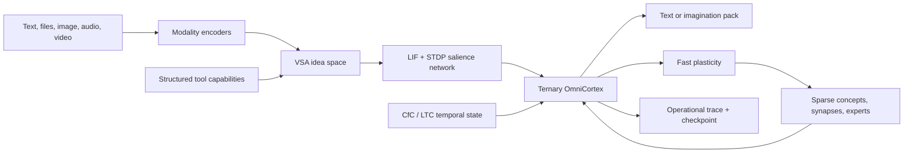

# Omni AGI Studio

Omni AGI Studio is a Windows 11 desktop research environment for building persistent, continuously adapting **OmniCortex** models. A brain may start from recorded random weights or a strictly validated compatible Omni checkpoint, then optionally pretrain on user-selected local data before its first conversation. It is not a wrapper around a hosted language model.

The project combines a tiny trainable ternary language cortex, spiking/STDP associative plasticity, liquid temporal state, vector-symbolic idea memory, structural growth, multimodal research packs, one continuous chat, traceable mutations, and portable forks.

> [!IMPORTANT]
> This is experimental software, not evidence of AGI, consciousness, or a faithful simulation of a human brain. A randomly initialized brain is primitive until it is trained. Learned weights and idea graphs are lossy; exact recall requires the optional local archive.

## What is real in the current architecture

- Effective ternary `{-1, 0, +1}` linear weights with higher-precision trainable master weights.
- Leaky integrate-and-fire state and local spike-timing-dependent plasticity.
- CfC/LTC-inspired continuous-time state.
- Compositional high-dimensional concept and idea fingerprints.
- Immediate fast-weight learning plus slower checkpointed consolidation.
- Parameter-only, human-consolidation, and total-recall memory recipes.
- A single persistent identity/chat per build with origin, snapshots, forks, and export.
- Tiny trainable image, audio, and video baselines that share the brain's idea space.
- Validated declarative build recipes and modality-only safe-tensor packs.
- Structured tool capabilities encoded through the VSA idea channel without adding tool-schema prose to the chat prompt.
- Direct chat tool calls, exact one-use approvals, cancellation, and visible operational audit records.
- Isolated source-evolution worktrees and active copy-on-write subagent brain forks.
- No RLHF, reward model, hidden behavioral persona prompt, or external chat API.



## Build and run behavior

The Build flow profiles the machine once before creation and resolves `Automatic` to a Micro, Personal, GPU, or Workstation recipe. The selected recipe scales model width, layers, sequence length, batch strategy, and media sizes. GPU tiers use CUDA when available, then DirectML when usable, and otherwise remain on CPU.

A blank origin is intentionally primitive. A compatible starter imports its learned safe-tensor state without re-randomizing it. Optional initial pretraining mutates the current copy after the immutable origin has been recorded, so the user can always restore the actual starting point.

Run is one continuous local chat. `/tool`, `/imagine`, and `/agent` invoke the same permission-checked executor available to model-produced `<omni-tool>` requests. Tool results are shown in the chat and returned as visible structured experience. A generated call chain is limited to four actions per turn.

## Windows 11 development

Prerequisites:

- Node.js 22+
- Python 3.10–3.12
- PyTorch matching the machine's CPU or CUDA runtime

```powershell
npm install
python -m pip install -r engine/requirements.txt
npm run test:python:portable
npm run dev
```

Create a packaged x64 build on x64 Windows:

```powershell
npm run package:win
```

Create a native ARM64 build on ARM64 Windows:

```powershell
npm run package:win:arm64
```

The app uses Electron's Windows 11 Mica background where supported and falls back to the same Fluent-inspired CSS surfaces elsewhere. Packaging produces NSIS and ZIP artifacts for x64 and ARM64. The Windows workflow uses matching native x64 and ARM64 Windows 11 runners, verifies both packaged worker layouts, and drives each installed application through build, chat, navigation, trace export, imagination, download, and full restart.

## Repository map

- `src/renderer/` — Windows 11 Build and Run interface.
- `src/main/` and `src/preload/` — isolated desktop lifecycle, IPC, tools, and brain supervision.
- `engine/` — custom PyTorch brain, multimodal packs, and JSON-lines worker.
- `docs/ARCHITECTURE.md` — implemented neural, tool, agent, and persistence paths.
- `docs/OMNI_FORMAT.md` — strict version-1 `.omni` container contract and privacy boundary.
- `docs/CATALOG_FORMATS.md` — non-executable recipe and `.omnipack` contracts.
- `BitNet-main/`, `snntorch-master/`, `ncps-master/` — attributed upstream research snapshots.
- `RESEARCH.md` — paper/repository-to-feature ledger.

## Privacy and authority

Brains live below `%LOCALAPPDATA%\OmniAGI\brains` by default. Network access is only used by enabled catalog, crawler, or web tools. Tool grants are stored separately from neural state and can be Off, Ask, Auto, or Full Authority. Ask approvals are short-lived, single-use, and bound to the exact brain, tool, action, and argument digest. Auto still asks for risky operations. Full Authority is intentionally powerful; every action remains visible in the operational trace, and running actions can be cancelled.

The browser tool is a real, isolated snapshot: it performs guarded fetching, sanitizes remote markup into an inert local document, runs only the app's fixed extraction routine, extracts bounded text and links, and saves a PNG. It is not a signed-in or interactive browser controller. Source evolution uses an authorized Git clone and a separate worktree for proposal, diff, allowlisted build/test, exact-diff validation, and optional promotion; it never overwrites the running binary.

`.omni` exports support current-portable, origin-portable, confirmed private-archive, and referenced-local modes. Portable modes omit retained source content, sanitize metadata, and downgrade shared tool grants. Recursive pattern-based secret redaction applies to JSON; private archives refuse detected credentials in retained text-like blobs. No detector can guarantee discovery of every user-authored secret, so inspect an archive before sharing it. Referenced-local exports are deliberately non-portable because their real tensor bytes remain in the originating installation's content-addressed store.

## License

Original Omni AGI Studio code is source-available under the [PolyForm Noncommercial License 1.0.0](LICENSE.md). Personal and noncommercial use, modification, and redistribution are allowed under those terms. Commercial use requires a [separate license](COMMERCIAL_LICENSE.md). Third-party components retain their own licenses.
