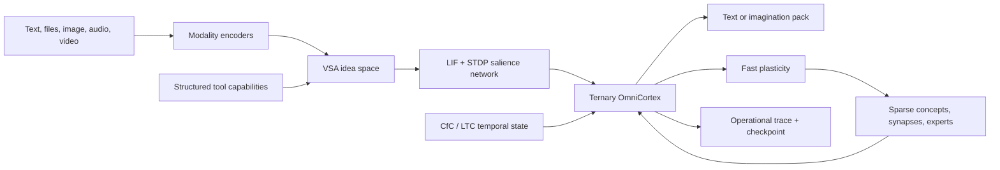

# Omni AGI Studio

Omni AGI Studio v1 is a Windows, macOS, and Linux desktop research environment for building persistent, continuously adapting **OmniCortex** models. A brain may start from recorded random weights or a strictly validated compatible Omni checkpoint, then optionally pretrain on user-selected local data before its first conversation. It is not a wrapper around a hosted language model.

The project combines a tiny trainable ternary language cortex, spiking/STDP associative plasticity, liquid temporal state, vector-symbolic idea memory, structural growth, multimodal research packs, one continuous chat, traceable mutations, and portable forks.

> [!IMPORTANT]
> This is experimental software, not evidence of AGI, consciousness, or a faithful simulation of a human brain. A randomly initialized brain is primitive until it is trained. Learned weights and idea graphs are lossy; exact recall requires the optional local archive.

## What is real in the current architecture

- Effective ternary `{-1, 0, +1}` linear weights with higher-precision trainable master weights.
- Leaky integrate-and-fire state and local spike-timing-dependent plasticity.
- CfC/LTC-inspired continuous-time state.
- Compositional high-dimensional concept and idea fingerprints.
- Immediate fast-weight learning plus slower checkpointed consolidation.
- Parameter-only, human-consolidation, and total-recall memory recipes.
- A single persistent identity/chat per build with origin, snapshots, forks, and export.
- Tiny trainable image, audio, and video baselines that share the brain's idea space, including latent denoising and local MP4 imagination output.
- Validated declarative build recipes and modality-only safe-tensor packs.
- Structured tool capabilities encoded through the VSA idea channel without adding tool-schema prose to the chat prompt.
- Direct chat tool calls, exact one-use approvals, cancellation, and visible operational audit records.
- Isolated source-evolution worktrees and active copy-on-write subagent brain forks.
- No RLHF, reward model, hidden behavioral persona prompt, or external chat API.


```mermaid
flowchart LR
  I["Text, files, image, audio, video"] --> E["Modality encoders"]
  E --> V["VSA idea space"]
  K["Structured tool capabilities"] --> V
  V --> S["LIF + STDP salience network"]
  S --> C["Ternary OmniCortex"]
  L["CfC / LTC temporal state"] --> C
  C --> O["Text or imagination pack"]
  C --> P["Fast plasticity"]
  P --> G["Sparse concepts, synapses, experts"]
  G --> C
  C --> T["Operational trace + checkpoint"]
```

## Build and run behavior

The Build flow profiles the machine once before creation and resolves `Automatic` to a Micro, Personal, GPU, or Workstation recipe. The selected recipe scales model width, layers, sequence length, batch strategy, and media sizes. GPU tiers use CUDA when available, then DirectML when usable, and otherwise remain on CPU.

A blank origin is intentionally primitive. The default bundled Omni Starter is a small project-authored baseline trained before its immutable origin is recorded; a compatible imported starter preserves its learned safe-tensor state without re-randomizing it. Optional initial data then trains the current copy while the true origin remains restorable.

Run is one continuous local chat. The learned action head can naturally select talk, tools, imagination, agents, pondering, learning, evolution, or stopping through a dedicated typed channel. The UI does not parse slash commands, prose tags, or generated response text into executable calls. Tool results and intermediate media are visible in chat and return as structured experience. Additional computation settles from neural convergence, working-memory pressure, and host-resource pressure rather than a user-set thought count.

## Desktop development

Prerequisites:

- Node.js 22+
- Python 3.10–3.12
- PyTorch matching the machine's CPU or CUDA runtime

```powershell
npm install
python -m pip install -r engine/requirements.txt
npm run test:python:portable
npm run dev
```

Create a package on a native host matching the requested architecture:

```powershell
# Windows x64
npm run package:win
# Windows ARM64
npm run package:win:arm64
```

```bash
# macOS
npm run package:mac:x64
npm run package:mac:arm64

# Linux
npm run package:linux:x64
npm run package:linux:arm64
```

Windows produces NSIS and ZIP files, macOS produces DMG and ZIP files, and Linux produces AppImage, DEB, and tar.gz files. Each package embeds a self-contained PyInstaller worker built on the matching OS and architecture. The Windows ARM64 shell intentionally carries an x64 worker for Windows 11 emulation because stable PyTorch Windows ARM64 wheels are not available.

The app uses Windows 11 Mica where supported and the same Fluent-inspired surfaces on other systems. Native-host workflows run source tests, package the worker and desktop, verify architecture, exercise the packaged worker, launch the packaged desktop through Playwright, restart it, and upload checksum-bearing evidence. See [docs/RELEASE.md](docs/RELEASE.md) for the stable release contract.

## Repository map

- `src/renderer/` — cross-platform Build and Run interface.
- `src/main/` and `src/preload/` — isolated desktop lifecycle, IPC, tools, and brain supervision.
- `engine/` — custom PyTorch brain, multimodal packs, and JSON-lines worker.
- `docs/ARCHITECTURE.md` — implemented neural, tool, agent, and persistence paths.
- `docs/COMPLETION_AUDIT.md` — requirement-to-code map and verified release gates.
- `docs/OMNI_FORMAT.md` — strict version-1 `.omni` container contract and privacy boundary.
- `docs/CATALOG_FORMATS.md` — non-executable recipe and `.omnipack` contracts.
- `licenses/` — preserved third-party license texts for the upstream research sources; source snapshots are intentionally not vendored.
- `RESEARCH.md` — paper/repository-to-feature ledger.

## Privacy and authority

Brains live below `%LOCALAPPDATA%\OmniAGI\brains` on Windows and the Electron application-data directory on macOS and Linux by default. Network access is only used by enabled catalog, crawler, or web tools. Tool grants are stored separately from neural state and can be Off, Ask, Auto, or Full Authority. Ask approvals are short-lived, single-use, and bound to the exact brain, tool, action, and argument digest. Auto still asks for risky operations. Full Authority is intentionally powerful; every action remains visible in the operational trace, and running actions can be cancelled.

The browser tool uses a sandboxed persistent per-brain session. It validates public-network destinations, can navigate, click, type, press keys, wait, extract, and capture screenshots, and denies browser permission requests, downloads, popups, private-network targets, and non-web navigation. A user-approved visible session can retain its sign-in cookies. Source evolution uses an authorized Git clone and a separate worktree for typed hash-bound authoring, diff, allowlisted build/test, exact-diff validation, and optional promotion; it never executes generated prose or overwrites the running binary mid-execution.

`.omni` exports support current-portable, origin-portable, confirmed private-archive, and referenced-local modes. Portable modes omit retained source content, sanitize metadata, and downgrade shared tool grants. Recursive pattern-based secret redaction applies to JSON; private archives refuse detected credentials in retained text-like blobs. No detector can guarantee discovery of every user-authored secret, so inspect an archive before sharing it. Referenced-local exports are deliberately non-portable because their real tensor bytes remain in the originating installation's content-addressed store.

## License

Original Omni AGI Studio code is source-available under the [PolyForm Noncommercial License 1.0.0](LICENSE.md). Personal and noncommercial use, modification, and redistribution are allowed under those terms. Commercial use requires a [separate license](COMMERCIAL_LICENSE.md). Third-party components retain their own licenses.
