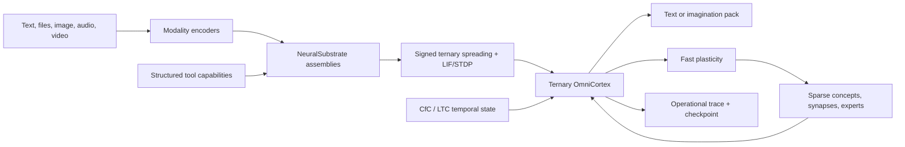

# Omni AGI Studio

Omni AGI Studio v1 is a Windows, macOS, and Linux desktop research environment for building persistent, continuously adapting **OmniCortex** models. Every new Build initializes its native core locally, learns a transparent local capability curriculum, and can then train on user-selected data before its first conversation. Import accepts only a verified native, ground-up OmniCortex `.omni`; it never converts or selects a Falcon, bundled Starter, Blank, foundation-adapter, or other legacy checkpoint.

The project combines a tiny trainable ternary language cortex, spiking/STDP associative plasticity, liquid temporal state, a unified growable neural substrate, hardware-sized working memory, multimodal research packs, one continuous chat, traceable mutations, and portable forks.

> [!IMPORTANT]
> This is experimental software, not evidence of AGI, consciousness, or a faithful simulation of a human brain. A randomly initialized brain is primitive until it is trained. Learned weights and distributed assemblies are lossy; exact recall requires the optional local archive.

## What is real in the current architecture

- Packed-authoritative ternary `{-1, 0, +1}` projection and spiking synapses;
  learning mutates those codes directly, without a full floating weight mirror.
- Leaky integrate-and-fire state and local spike-timing-dependent plasticity.
- CfC/LTC-inspired continuous-time state.
- Compositional high-dimensional neuron assemblies with exact signed ternary recurrent pathways.
- Immediate fast-weight learning plus slower checkpointed adaptive retention.
- Recurrent spreading activation that includes excitatory and inhibitory edges and settles without a fixed hop count.
- Content-addressed substrate shards for neurons, assemblies, packed ternary
  synapses, and transient plasticity metadata.
- Adaptive-retention, total-recall, and synapses-only memory recipes.
- Hardware-sized temporary token/sensory context, latent workspace slots, rehearsal, decay, and eviction.
- A single persistent identity/chat per build with origin, snapshots, forks, and export.
- Tiny trainable image, audio, and video baselines that share the brain's substrate, including progressive hardware-bounded mid-turn previews and local MP4 imagination output.
- Validated declarative build recipes and modality-only safe-tensor packs.
- Structured tool capabilities encoded through the VSA assembly channel without adding tool-schema prose to the chat prompt.
- Natural typed talk, tool, imagination, agent, ponder, learn, evolve, and stop choices, with direct chat cards, exact one-use approvals, cancellation, and visible operational audit records.
- Isolated source-evolution worktrees and active copy-on-write subagent brain forks whose reviewed merges are bound to an authoritative digest of both neural states.
- Streaming ZIP/ZIP64 `.omni` export and import with no product-defined archive-byte or entry-count ceiling; disk reserve and platform file limits remain real boundaries.
- No RLHF, reward model, hidden behavioral persona prompt, or external chat API.


```mermaid
flowchart LR
  I["Text, files, image, audio, video"] --> E["Modality encoders"]
  E --> V["NeuralSubstrate assemblies"]
  K["Structured tool capabilities"] --> V
  V --> S["Signed ternary spreading + LIF/STDP"]
  S --> C["Ternary OmniCortex"]
  L["CfC / LTC temporal state"] --> C
  C --> O["Text or imagination pack"]
  C --> P["Fast plasticity"]
  P --> G["Sparse concepts, synapses, experts"]
  G --> C
  C --> T["Operational trace + checkpoint"]
```

## Build and run behavior

The Build flow profiles the machine once before creation and resolves `Automatic` to a Micro, Personal, GPU, or Workstation recipe. It calculates the native architecture's exact parameter inventory directly from the tier and selected recurrent/paged working-memory population. Token context and recurrent memory items are separate kinds of temporary working space. A verified imported native OmniCortex retains its recorded context/model shape, and the Runtime Card reports the effective values. The selected recipe also scales model width, layers, safe physical batch size, checkpointing, and media sizes. Whole-input integration latents expand with the selected recurrent workspace. GPU tiers use CUDA when available, then DirectML when usable, and otherwise remain on CPU.

Context capacity and response length are separate. A persisted, capacity-bounded ring of recent human/brain role-boundary tokens supplies multi-turn working context; its occupancy, hash, and evictions are visible. It never contains silently retrieved long-term source passages, behavioral instructions, or tool-schema prose. A hardware- and neural-state-derived response budget keeps a large context from forcing thousands of generated tokens on every CPU turn; explicit callers may still request a different response limit. These capacities are physical working space, not personality controls or long-term-memory limits.

Each new Build initializes OmniCortex's own packed ternary weights locally,
trains on the hash-described project curriculum and explicit initial resources,
and then records a verified origin. Import preserves an accepted native
OmniCortex's safe-tensor state and ground-up provenance, but rejects old
Starter, Blank, Falcon/foundation, hybrid, and incompatible-schema packages
instead of relabeling them. Rejected files remain untouched on disk. The
packed-only action curriculum is still under focused convergence verification;
do not assume a fresh Build is conversationally capable. See
[the technical origin contract](docs/GROUND_UP_OMNICORTEX.md).

Run is one continuous local chat. The learned action head can naturally select talk, tools, imagination, agents, pondering, learning, evolution, or stopping through a dedicated typed channel. The UI does not parse slash commands, prose tags, or generated response text into executable calls. Tool results and ordered progressive image/audio/video previews are visible in chat and return as structured experience. Preview cadence is bounded by local hardware and model size; it is neither frame-synchronous with language tokens nor guaranteed instantaneous. Additional computation and recurrent association settle from neural convergence, interference, working-memory pressure, and host-resource pressure rather than a user-set thought or recall count.

Long-term substrate decay can reduce activation and plastic strength but never cardinality-evicts learned neuron, assembly, synapse, or vector records. Replay, metaplastic stability, immutable origins, and rollback checkpoints resist catastrophic forgetting while still allowing adaptation. Lossy neural memory does not guarantee verbatim recall; an explicitly archived source may remain readable as a file, but that is not the same as the model remembering it in its weights.

## Desktop development

Prerequisites:

- Node.js 22+
- Python 3.10–3.12
- PyTorch matching the machine's CPU or CUDA runtime

```powershell
npm install
python -m pip install -r engine/requirements.txt
npm run test:python:portable
npm run dev
```

Release worker packaging specifically uses CPython 3.11. The platform build
scripts install the matching binary-only SHA-256 lock from `engine/locks`
(including the exact PyInstaller toolchain) before producing the worker.
Development can continue to use the exact top-level pins above; release inputs
and their full transitive closure are documented in [the release contract](docs/RELEASE.md).

Create a package on a native host matching the requested architecture:

```powershell
# Windows x64
npm run package:win
# Windows ARM64
npm run package:win:arm64
```

```bash
# macOS
npm run package:mac:x64
npm run package:mac:arm64

# Linux
npm run package:linux:x64
npm run package:linux:arm64
```

Windows produces NSIS and ZIP files, macOS produces DMG and ZIP files, and Linux produces AppImage, DEB, and tar.gz files. Each package embeds a self-contained PyInstaller worker built on the matching OS and architecture. The Windows ARM64 shell intentionally carries an x64 worker for Windows 11 emulation because stable PyTorch Windows ARM64 wheels are not available.

The app uses Windows 11 Mica where supported and the same Fluent-inspired surfaces on other systems. Native-host CI checks source, UI contracts, package structure, worker health, and packaged desktop startup without creating or training a brain. A trained ground-up brain and its capabilities require separate live acceptance. See [docs/RELEASE.md](docs/RELEASE.md) for the release contract.

## Mobile companions

The native Android and iPhone/iPad companions pair with the opt-in gateway on the desktop. They do not contain another language model: mobile chat, history, learning attachments, imagination/actions, and cancellations operate on the same persistent brain and permission system running in Studio. Pairing uses a five-minute one-time code, mobile credentials are stored in Android private preferences or Apple Keychain, and the desktop stores only a SHA-256 token digest. HTTP is loopback/emulator-only; LAN pairing uses a per-installation TLS certificate whose SHA-256 pin is carried out of band in the displayed pairing address.

```bash
# Android debug APK and unit tests
npm run test:android
npm run package:android:debug

# iOS simulator, unsigned IPA, or a credential-backed custom-signed IPA
npm run test:ios
npm run package:ios:unsigned
OMNI_IOS_TEAM_ID=YOURTEAMID npm run package:ios:signed
```

See [`mobile/android/README.md`](mobile/android/README.md) and [`mobile/ios/README.md`](mobile/ios/README.md) for emulator, device-pairing, Xcode-license, and signing details. iOS requires Apple signing and provisioning before an IPA can be installed on a physical device.

## Repository map

- `src/renderer/` — cross-platform Build and Run interface.
- `src/main/` and `src/preload/` — isolated desktop lifecycle, IPC, tools, and brain supervision.
- `engine/` — custom PyTorch brain, multimodal packs, and JSON-lines worker.
- `mobile/android/` and `mobile/ios/` — native same-brain companions and emulator tests.
- `docs/ARCHITECTURE.md` — implemented neural, tool, agent, and persistence paths.
- `docs/GROUND_UP_OMNICORTEX.md` — new-Build origin, training, no-fallback, scale, and readiness contract.
- `docs/DISK_SPACE_CONTRACT.md` — one measured space-left and device-adaptive reserve contract for Build, training, and storage operations.
- `docs/COMPLETION_AUDIT.md` — requirement-to-code map and verified release gates.
- `docs/OMNI_FORMAT.md` — strict version-1 `.omni` container contract and privacy boundary.
- `docs/SUBSTRATE_PERSISTENCE.md` — content-addressed substrate generations, bounded shards, and exact signed recurrent activation.
- `docs/CATALOG_FORMATS.md` — non-executable recipe and `.omnipack` contracts.
- `docs/TRAINING.md` — native initial curriculum, continual learning, and recovery limits.
- `docs/OMNI_STARTER.md` — retired Starter, Falcon/FoundationCortex, and Nova history; none is a current Build or Import option.
- `licenses/` — preserved third-party license texts for the upstream research sources; source snapshots are intentionally not vendored.
- `RESEARCH.md` — paper/repository-to-feature ledger.

A developer may retain the ignored `.runtime/bitnet-src` checkout as a research
reference for comparing published Microsoft kernels and file formats. Studio
does not import, link, execute, package, or expose that checkout as a model or
Build option; deleting it is not part of normal application cleanup.

## Privacy and authority

Brains live below `%LOCALAPPDATA%\OmniAGI\brains` on Windows and the Electron application-data directory on macOS and Linux by default. Network access is only used by enabled catalog, crawler, or web tools. Tool grants are stored separately from neural state and can be Off, Ask, Auto, or Full Authority. Ask approvals are short-lived, single-use, and bound to the exact brain, tool, action, and argument digest. Auto still asks for risky operations. Full Authority is intentionally powerful; every action remains visible in the operational trace, and running actions can be cancelled.

Tools & permissions also connects MCP servers over Streamable HTTP or an explicitly installed local stdio executable. Discovered tool names and structural schemas are learned into the brain and can be selected naturally in chat; untrusted server descriptions never become prompt text. Web search has a credential-free public RSS fallback, while an optional SearXNG endpoint can still be configured. Completed organic research evidence is learned without creating a hidden prompt.

API teacher learning supports OpenAI, Anthropic, and Gemini. A user supplies explicit learning questions; the provider response is encoded into the same fast synapses, assemblies, replay, and slow weights as other data. No provider request includes a system prompt, and the trajectory records no RLHF or reward model. Keys are stored outside all brains and exports through the OS encryption service, or held only for the current session if secure storage is unavailable. Ask approvals default to a visible 30-second countdown and can be changed from Tools & permissions.

The browser tool uses a sandboxed persistent per-brain session. It validates public-network destinations, can navigate, click, type, press keys, wait, extract, and capture screenshots, and denies browser permission requests, downloads, popups, private-network targets, and non-web navigation. A user-approved visible session can retain its sign-in cookies. Source evolution uses an authorized Git clone and a separate worktree for typed hash-bound authoring, diff, allowlisted build/test, exact-diff validation, and optional promotion; it never executes generated prose or overwrites the running binary mid-execution. Full Authority may stage a passing native runtime in a separately hashed app-data slot and schedule a delayed packaged-app relaunch; Ask/Auto never activate it, and development/test hosts keep the slot deferred.

`.omni` exports support current-portable, origin-portable, confirmed private-archive, and referenced-local modes. Export and import stream ZIP/ZIP64 entries and substrate shards instead of buffering a complete brain; there is no product-defined archive-size or entry-count cutoff, but operations pause before crossing the configured disk reserve. Import additionally requires current native ground-up OmniCortex provenance and the exact supported schema; legacy compatibility is not a selectable mode. Portable modes omit retained source content, sanitize metadata, and downgrade shared tool grants. Recursive pattern-based secret redaction applies to JSON; private archives refuse detected credentials in retained text-like blobs. No detector can guarantee discovery of every user-authored secret, so inspect an archive before sharing it. Referenced-local exports are deliberately non-portable because their real tensor bytes remain in the originating installation's content-addressed store.

## License

Original Omni AGI Studio code is source-available under the [PolyForm Noncommercial License 1.0.0](LICENSE.md). Personal and noncommercial use, modification, and redistribution are allowed under those terms. Commercial use requires a [separate license](COMMERCIAL_LICENSE.md). Third-party components retain their own licenses.
